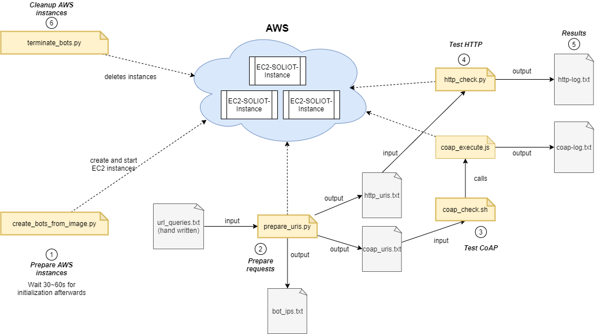

# SOLIOT Evaluation

This repository contains the SOLIOT evaluation tools, measurements and results. The goal of the overall project is to use the advantages of the SOLID approach and introduce it into the IoT and Industry 4.0 community. The originally measured values can be found in the folders [coap_logs](coap_logs) for the SOLIOT server and [http_logs](http_logs) of the SOLID Baseline server, as measured be the evalutating client instance.
Server-side measures are collected in [solid server logs](solid server logs) and [eval server logs](eval server logs).
The Excel file in [Evaluation](Evaluation) collects the raw data and is used for the KPI calculation.

## Related Resources

SOLIOT IoT server implementation: [SOLIOT on GitHub](https://github.com/sebbader/soliot)
SOLID server implementation: [SOLID on GitHub](https://github.com/sebbader/solid) 
Evaluation Data: [SOLIOT Performance Resources](https://github.com/sebbader/soliot_evaluation) (this repository)

## Team

Contact: [Sebastian Bader](https://github.com/sebbader) ([email](mailto:sebastian.bader@iais.fraunhofer.de))

 

Overview:

## Installation
`pip install requirements.txt`.
`npm install`.
([Configure aws-shell for boto3](https://boto3.amazonaws.com/v1/documentation/api/latest/guide/quickstart.html))

## Usage
In directory soliot-evaluation:
`python create_bots_from_image.py`.
Wait a 30~60 seconds for the creation and initialization to be finished.

Run `python prepare_uris.py` to prepare the requests for the test scripts.

Run `python http_check.py` to execute the HTTP-tests.

Run `./coap_check.sh` to execute the CoAP-tests.

When finished, terminate (deleting permanently) the instances with `python terminate_bots.py`.